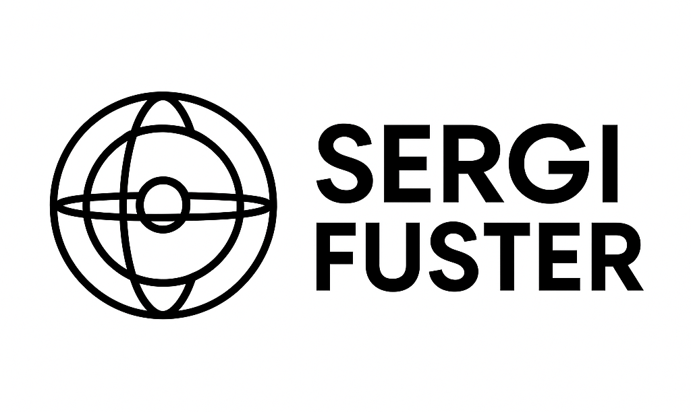

 

# 👋 Hi, I'm Sergi Fuster

🎯 **Backend Developer** | 🐍 **Python Specialist** | 🧠 **AI, LLMs & Agents**

I'm a backend developer focused on building robust, scalable systems powered by **Python** and **Artificial Intelligence**. I specialize in **Large Language Models (LLMs)** and **intelligent agent architectures**, working on the intersection of backend development and applied AI.

Currently, I work at the tech company **[Cuatroochenta](https://cuatroochenta.com/)**, where we develop innovative digital solutions and AI-powered applications.

---

## 🛠️ Tech Stack

- **Languages:** Python  
- **Frameworks:** FastAPI  
- **AI & Data Science:** PyTorch, Hugging Face, LangGraph, scikit-learn, Ollama  
- **DevOps:** Docker, GitHub  
- **Others:** Redis, PostgreSQL, RabbitMQ, REST APIs

---

## 🚀 What I'm Working On

- Intelligent agents powered by LLMs and external tools  
- AI-first backend architectures  
- Personal projects combining automation, NLP, and symbolic reasoning

---

## 📫 Get in Touch

---

⭐ **Thanks for stopping by! If you find something interesting in my repos, feel free to star it or reach out.**

