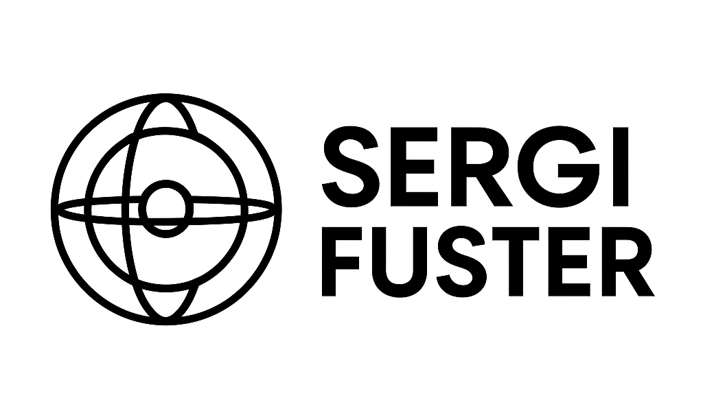

 

# Sergi Fuster
**AI Engineer | Python Specialist**

Ingeniero de IA enfocado en el desarrollo de sistemas robustos y arquitecturas de agentes escalables. Mi enfoque principal es la integración de Large Language Models (LLMs) mediante flujos de trabajo tipados y validados.

Actualmente desarrollo soluciones de inteligencia aplicada en **[Cuatroochenta](https://cuatroochenta.com/)**.

---

## Especialización Técnica

Mi flujo de trabajo se fundamenta en la robustez y el diseño orientado a datos. Utilizo **PydanticAI** como framework principal para la orquestación de agentes, garantizando la integridad de los datos y el control estricto sobre las respuestas de los modelos.

* **Core:** Python (Especialista).
* **Orquestación y Agentes:** PydanticAI.
* **Desarrollo de Modelos:** Pytorch.
* **Infraestructura Backend:** FastAPI, PostgreSQL, Redis.
* **Entorno:** Docker, Arquitecturas basadas en microservicios.

---

## Proyectos y Enfoque

* Desarrollo de agentes inteligentes con herramientas externas y razonamiento simbólico.
* Arquitecturas AI-first diseñadas para escalabilidad y baja latencia.
* Automatización de procesos complejos mediante procesamiento de lenguaje natural (NLP).

---

## Contacto

---

